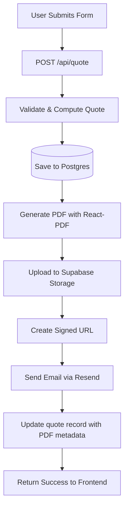

# PDF Quote Generation Implementation Plan

## Architecture Comparison

### Your Proposed Plan vs Current Stack

**Aligned Elements (No Changes Needed)**

- Link-based PDF delivery approach - Excellent choice, avoids attachment issues
- Vercel serverless functions - Already planned for API deployment
- Supabase PostgreSQL - Already implemented and working
- Private storage with signed URLs - Best practice for security

**Enhancements Based on Current Architecture**

- Use existing Express API structure in `[api/src/](api/src/)` instead of separate serverless functions
- Integrate with current `[api/src/quote.ts](api/src/quote.ts)` flow
- Extend existing database schema in `[api/schema.sql](api/schema.sql)`
- Replace generic SMTP with Resend API for better Vercel integration

## Technical Architecture




## Implementation Steps

### 1. Database Schema Updates

**File**: `[api/schema.sql](api/schema.sql)`

Add PDF tracking columns to existing `quotes` table:

```sql
ALTER TABLE quotes ADD COLUMN IF NOT EXISTS pdf_path TEXT;
ALTER TABLE quotes ADD COLUMN IF NOT EXISTS pdf_generated_at TIMESTAMPTZ;
ALTER TABLE quotes ADD COLUMN IF NOT EXISTS pdf_url_expires_at TIMESTAMPTZ;
ALTER TABLE quotes ADD COLUMN IF NOT EXISTS email_sent_at TIMESTAMPTZ;

CREATE INDEX IF NOT EXISTS idx_quotes_pdf_path ON quotes (pdf_path) WHERE pdf_path IS NOT NULL;
```

This preserves your existing schema while adding PDF tracking.

### 2. Install Required Dependencies

**File**: `[api/package.json](api/package.json)`

```bash
npm install @react-pdf/renderer @supabase/supabase-js resend
npm install --save-dev @types/react
```

**Rationale**:

- `@react-pdf/renderer` - React-based PDF generation (your choice)
- `@supabase/supabase-js` - Official Supabase client for Storage API
- `resend` - Modern email API with excellent Vercel support (your choice)

### 3. Environment Variables

**File**: `[api/.env.example](api/.env.example)`

Add new variables:

```bash
# Supabase Storage
SUPABASE_URL=https://your-project.supabase.co
SUPABASE_SERVICE_ROLE_KEY=your-service-role-key
SUPABASE_STORAGE_BUCKET=quotes

# Resend (replaces SMTP_*)
RESEND_API_KEY=re_xxxxxxxxxxxxx
RESEND_FROM_EMAIL=quotes@squeegee-samurai.com

# PDF Settings
PDF_URL_EXPIRY_HOURS=72
```

**Migration Note**: Keep existing SMTP variables for backward compatibility during transition.

### 4. Supabase Storage Setup

**Recommended**: Create bucket via **Supabase UI** (Storage section):
- Bucket name: `quotes`
- Visibility: **Private**
- No public access

**Note**: Service role key bypasses RLS policies, so explicit SQL policies are optional for server-side-only access. UI creation is simpler and less error-prone for MVP.

### 5. Create PDF Template Component

**New File**: `[api/src/pdf/QuoteTemplate.tsx](api/src/pdf/QuoteTemplate.tsx)`

```typescript
import { Document, Page, Text, View, StyleSheet, Image } from '@react-pdf/renderer';

const styles = StyleSheet.create({
  page: {
    padding: 40,
    fontFamily: 'Helvetica',
    fontSize: 11,
  },
  header: {
    fontSize: 24,
    marginBottom: 20,
    color: '#1a365d',
  },
  section: {
    marginBottom: 15,
  },
  // ... Japanese minimalist aesthetic matching your brand
});

export function QuoteTemplate({ quote, contact, breakdown }: QuoteData) {
  return (
    <Document>
      <Page size="A4" style={styles.page}>
        {/* Logo, company info */}
        <View style={styles.header}>
          <Text>Squeegee Samurai</Text>
          <Text style={styles.tagline}>Clarity through Pane</Text>
        </View>
        
        {/* Quote details */}
        <View style={styles.section}>
          <Text>Quote ID: {quote.id}</Text>
          <Text>Prepared for: {contact.firstName} {contact.lastName}</Text>
          <Text>Date: {new Date(quote.createdAt).toLocaleDateString()}</Text>
        </View>
        
        {/* Pricing breakdown */}
        {/* ... implement based on your residential/commercial pricing models */}
      </Page>
    </Document>
  );
}
```

### 6. Create PDF Generation Service

**New File**: `[api/src/services/pdfService.ts](api/src/services/pdfService.ts)`

```typescript
import { renderToStream } from '@react-pdf/renderer';
import { createClient } from '@supabase/supabase-js';
import { QuoteTemplate } from '../pdf/QuoteTemplate.js';
import type { QuoteResult, QuoteBody } from '../quoteLogic.js';

const supabase = createClient(
  process.env.SUPABASE_URL!,
  process.env.SUPABASE_SERVICE_ROLE_KEY!
);

export async function generateAndUploadPDF(
  quoteId: string,
  quoteData: QuoteBody,
  result: QuoteResult
): Promise<{ path: string; signedUrl: string; expiresAt: Date }> {
  // 1. Generate PDF
  const stream = await renderToStream(
    <QuoteTemplate quote={{ id: quoteId, ...result }} contact={quoteData.contact} breakdown={result.breakdown} />
  );

  // 2. Upload to Supabase Storage
  const fileName = `${quoteId}.pdf`;
  const filePath = `quotes/${new Date().getFullYear()}/${fileName}`;
  
  const { data: uploadData, error: uploadError } = await supabase.storage
    .from(process.env.SUPABASE_STORAGE_BUCKET!)
    .upload(filePath, stream, {
      contentType: 'application/pdf',
      upsert: false,
    });

  if (uploadError) throw uploadError;

  // 3. Create signed URL
  const expiryHours = parseInt(process.env.PDF_URL_EXPIRY_HOURS || '72');
  const expiresAt = new Date(Date.now() + expiryHours * 60 * 60 * 1000);
  
  const { data: signedData, error: signError } = await supabase.storage
    .from(process.env.SUPABASE_STORAGE_BUCKET!)
    .createSignedUrl(filePath, expiryHours * 3600);

  if (signError) throw signError;

  return {
    path: filePath,
    signedUrl: signedData.signedUrl,
    expiresAt,
  };
}
```

### 7. Update Email Service for Resend

**File**: `[api/src/email.ts](api/src/email.ts)`

Replace SMTP implementation with Resend:

```typescript
import { Resend } from 'resend';

const resend = new Resend(process.env.RESEND_API_KEY);

export async function sendQuoteEmail(
  recipientEmail: string,
  recipientName: string,
  pdfUrl: string,
  quoteId: string,
  expiresAt: Date
): Promise<void> {
  const expiryDate = expiresAt.toLocaleDateString();
  
  await resend.emails.send({
    from: process.env.RESEND_FROM_EMAIL!,
    to: recipientEmail,
    subject: 'Your Squeegee Samurai Quote is Ready',
    html: `
      <h2>Hi ${recipientName},</h2>
      <p>Thank you for requesting a quote from Squeegee Samurai.</p>
      <p><strong><a href="${pdfUrl}">View Your Quote (PDF)</a></strong></p>
      <p>This link expires on ${expiryDate}.</p>
      <p>Questions? Reply to this email or call (540) 335-1059.</p>
      <p>—<br/>The Squeegee Samurai Team</p>
    `,
  });
}

export async function sendOwnerNotification(
  quoteData: QuoteBody,
  result: QuoteResult,
  quoteId: string,
  pdfUrl: string
): Promise<void> {
  // Send notification to owner with quote details and PDF link
  await resend.emails.send({
    from: process.env.RESEND_FROM_EMAIL!,
    to: process.env.NOTIFY_EMAIL!,
    subject: `New Quote: ${quoteData.contact.email} - $${result.totalCents / 100}`,
    html: `
      <h3>New Quote Received</h3>
      <p><strong>Quote ID:</strong> ${quoteId}</p>
      <p><strong>Contact:</strong> ${quoteData.contact.firstName} ${quoteData.contact.lastName}</p>
      <p><strong>Email:</strong> ${quoteData.contact.email}</p>
      <p><strong>Total:</strong> $${result.totalCents / 100}</p>
      <p><a href="${pdfUrl}">View Quote PDF</a></p>
    `,
  });
}
```

### 8. Update Quote API Handler

**File**: `[api/src/quote.ts](api/src/quote.ts)`

Integrate PDF generation into existing flow (after line 106):

```typescript
import type { VercelRequest, VercelResponse } from '@vercel/node';
import { pool } from '../api-lib/db.js';
import { computeQuote } from '../api-lib/quoteLogic.js';
import { generateAndUploadPDF } from '../api-lib/pdfService.js';
import { sendQuoteEmail, sendOwnerNotification } from '../api-lib/email.js';

export default async function handler(req: VercelRequest, res: VercelResponse) {
  if (req.method !== 'POST') {
    return res.status(405).json({ error: 'Method not allowed' });
  }

  // ... validation logic (same as current quote.ts) ...
  
  // ... compute quote and insert to DB (same as current) ...
  
  // After successful DB insert:
  let pdfPath: string | null = null;
  let pdfExpiresAt: Date | null = null;

  try {
    const pdfResult = await generateAndUploadPDF(quoteId, validated.data, result);
    pdfPath = pdfResult.path;
    pdfExpiresAt = pdfResult.expiresAt;

    // Update database with PDF metadata
    const client = await pool.connect();
    try {
      await client.query(
        `UPDATE quotes SET 
          pdf_path = $1, 
          pdf_generated_at = NOW(), 
          pdf_url_expires_at = $2,
          pdf_status = 'generated'
        WHERE id = $3`,
        [pdfPath, pdfExpiresAt, quoteId]
      );

      // Send emails (customer + owner)
      await sendQuoteEmail(
        validated.data.contact.email,
        validated.data.formInput.businessName, // Handle commercial flow
        pdfResult.signedUrl,
        quoteId,
        pdfExpiresAt
      );

      await sendOwnerNotification(validated.data, result, quoteId, pdfResult.signedUrl);

      // Mark email sent
      await client.query(
        `UPDATE quotes SET email_sent_at = NOW(), email_status = 'sent' WHERE id = $1`,
        [quoteId]
      );
    } finally {
      client.release();
    }
  } catch (e) {
    console.error('PDF/Email failed (quote saved):', e);
    // Don't fail the request - quote is already saved
    // Log error to database for debugging
    const client = await pool.connect();
    try {
      await client.query(
        `UPDATE quotes SET pdf_status = 'failed', email_status = 'failed', email_error = $1 WHERE id = $2`,
        [e instanceof Error ? e.message : 'Unknown error', quoteId]
      );
    } finally {
      client.release();
    }
  }

  return res.status(201).json({
    success: true,
    quoteId,
    total: Math.round(result.totalCents / 100),
    breakdown: result.breakdown,
    message: "Quote received. We'll be in touch within 24 hours.",
  });
}
```

### 9. Storage Bucket Configuration

**Bucket Structure** (inside `quotes` bucket):

```
2026/
├── {uuid-1}.pdf
├── {uuid-2}.pdf
2027/
└── {uuid-3}.pdf
```

**Critical Path Format**:
```typescript
// CORRECT (path inside bucket)
const filePath = `${year}/${quoteId}.pdf`;

// WRONG (quotes/ prefix is bucket name, not path)
const filePath = `quotes/${year}/${quoteId}.pdf`; // ❌
```

**Retention Policy**: Consider implementing cleanup of expired PDFs via Supabase cron job:

```sql
-- Optional: Auto-delete expired PDFs (run weekly)
DELETE FROM storage.objects
WHERE bucket_id = 'quotes'
  AND created_at < NOW() - INTERVAL '90 days';
```

## Vercel Deployment Considerations

### API Routes Structure

Your current `[api/](api/)` folder can deploy to Vercel as:

- **Option A**: Single serverless function (simpler, your current Express app)
- **Option B**: Split into `/api` routes (more granular scaling)

**Recommendation**: Option A (single function) for MVP simplicity.

**File**: `[vercel.json](vercel.json)` (create in root)

```json
{
  "version": 2,
  "builds": [
    { "src": "frontend/package.json", "use": "@vercel/static-build", "config": { "distDir": "dist" } },
    { "src": "api/src/index.ts", "use": "@vercel/node" }
  ],
  "routes": [
    { "src": "/api/(.*)", "dest": "api/src/index.ts" },
    { "src": "/(.*)", "dest": "frontend/$1" }
  ]
}
```

### Environment Variables in Vercel

Set via Vercel dashboard or CLI:

- `DATABASE_URL` (Supabase connection string)
- `SUPABASE_URL`
- `SUPABASE_SERVICE_ROLE_KEY`
- `RESEND_API_KEY`
- All other vars from `.env.example`

## File Naming Convention

Your proposed naming is good. Recommendation:

```
{quoteId}.pdf
```

**Advantages**:

- Simple, deterministic
- Easy debugging (UUID matches database)
- No date parsing needed
- Folder structure (by year) provides organization

## Testing Checklist

1. PDF Generation
  - Residential quote with all pricing tiers
  - Commercial quote with first-time uplift
  - Special characters in contact info
  - Long additional services lists
  - Logo and branding render correctly
2. Storage
  - PDF uploads successfully
  - Signed URLs are accessible
  - Signed URLs expire correctly
  - Private bucket prevents public access
3. Email
  - Customer receives email with working link
  - Owner receives notification
  - Email formatting displays correctly
  - Links work on mobile devices
4. Error Handling
  - Quote saves even if PDF fails
  - Quote saves even if email fails
  - Appropriate error logging
  - User receives success message
5. Performance
  - PDF generation completes within Vercel timeout (10s default)
  - Concurrent requests don't overwhelm system

## Migration Path

### Phase 1: Add PDF Generation (Non-Breaking)

1. Deploy schema changes
2. Deploy API with PDF generation
3. Test with new quotes (old quotes unaffected)

### Phase 2: Email Cutover

1. Add Resend alongside existing SMTP
2. Test Resend in production
3. Switch primary to Resend
4. Remove SMTP after confirmation

### Phase 3: Enhancements (Post-MVP)

- PDF regeneration endpoint for owner dashboard
- Custom branding per quote type
- Multiple signed URL lifetimes
- Analytics on PDF opens (via proxy endpoint)

## Key Improvements to Your Plan

1. **React-PDF Integration**: Lighter weight than Puppeteer, better Vercel fit
2. **Resend Email**: Modern API, better deliverability than SMTP, Vercel-optimized
3. **Existing API Integration**: Extends current `[api/src/quote.ts](api/src/quote.ts)` rather than separate functions
4. **Database Evolution**: Non-breaking schema additions
5. **Error Isolation**: PDF/email failures don't prevent quote save
6. **Folder Organization**: Year-based structure for scalability
7. **Type Safety**: Full TypeScript integration with existing codebase

## Cost Estimates (Monthly)

**Supabase Storage**:

- 1GB free tier (≈1,000 PDFs at 1MB each)
- $0.021/GB after

**Resend**:

- 100 emails/day free (3,000/month)
- $20/month for 50,000 emails

**Vercel**:

- Hobby: Free (10s timeout, sufficient for PDF generation)
- Pro: $20/month (60s timeout, better for high volume)

## Security Considerations

1. **Private Bucket**: PDFs not publicly accessible
2. **Signed URLs**: Time-limited, auto-expiring
3. **Service Role Key**: Stored in env vars, never in code
4. **Email Validation**: Already implemented in existing API
5. **Rate Limiting**: Consider adding to prevent abuse (future)

## Documentation Updates Needed

- `[docs/dev_workflow.md](docs/dev_workflow.md)`: Add Supabase Storage setup
- `[docs/api-contract.md](docs/api-contract.md)`: Document PDF fields in response
- `[docs/schema.md](docs/schema.md)`: Add PDF columns documentation
- Create `[docs/pdf-templates.md](docs/pdf-templates.md)`: PDF design guidelines


---

## CRITICAL IMPLEMENTATION NOTES (Final Adjustments)

### 1. PDF Buffer Generation - Version-Agnostic Approach

**DO NOT hard-rely on `renderToBuffer()`** - different @react-pdf/renderer versions have different APIs.

**Preferred approach** (works with most versions):
```typescript
import { pdf } from '@react-pdf/renderer';

const pdfDoc = pdf(<QuoteTemplate {...props} />);
const pdfBuffer = await pdfDoc.toBuffer();
```

**Fallback** if `toBuffer()` doesn't exist:
```typescript
import { renderToStream } from '@react-pdf/renderer';

async function streamToBuffer(component: React.ReactElement): Promise<Buffer> {
  const stream = await renderToStream(component);
  const chunks: Buffer[] = [];
  return new Promise((resolve, reject) => {
    stream.on('data', (chunk) => chunks.push(chunk));
    stream.on('end', () => resolve(Buffer.concat(chunks)));
    stream.on('error', reject);
  });
}
```

### 2. Vercel Function Timeout & Runtime

**CRITICAL**: PDF generation + upload + email can approach Vercel timeout limits.

**Requirements**:
- Use **Node.js runtime** (not Edge) - Edge lacks Node APIs for PDF generation
- Monitor execution time in development
- Keep PDF template lightweight (no external image fetches)

**Timeout Limits**:
- Hobby plan: 10 seconds (may be tight)
- Pro plan: 15 seconds default, configurable up to 60s

**Configure maxDuration** (Pro plan only):
```typescript
// api/quote.ts
export const config = {
  maxDuration: 30, // seconds
};
```

**Optimization tips**:
- Embed logo as base64 (or omit for MVP)
- No external HTTP requests in PDF generation
- Pre-compute all data before PDF render

### 3. Database Schema - Optional Robustness Fields

Beyond basic tracking, consider adding:

```sql
-- Track when PDF object was created (vs when signed URL was generated)
ALTER TABLE quotes ADD COLUMN IF NOT EXISTS pdf_object_created_at TIMESTAMPTZ;
ALTER TABLE quotes ADD COLUMN IF NOT EXISTS signed_url_last_generated_at TIMESTAMPTZ;
```

**Why**: Signed URLs expire, but the PDF object persists. Tracking both helps with regenerating URLs later.

**For MVP**: These are optional - basic `pdf_path` and `pdf_url_expires_at` are sufficient.

### 4. Execution Order (Step-by-Step)

Follow this exact sequence:

1. **Database**: Run SQL migrations → verify schema
2. **Supabase**: Create private `quotes` bucket → test upload manually  
3. **Vercel Env**: Add all new environment variables
4. **Code Structure**: Create `/api/quote.ts` serverless handler → import from `api-lib/`
5. **PDF Service**: Implement with `pdf().toBuffer()` (or stream fallback)
6. **Email**: Switch to Resend API → test locally
7. **Test**: Local → Vercel preview → production

### 5. Path Gotchas

**CRITICAL**: Inside Supabase Storage bucket, path does NOT include bucket name:

```typescript
// ✅ CORRECT
const filePath = `${year}/${quoteId}.pdf`;
await supabase.storage.from('quotes').upload(filePath, buffer);

// ❌ WRONG
const filePath = `quotes/${year}/${quoteId}.pdf`; // 'quotes' is the bucket, not part of path
```

### 6. Commercial Contact Handling

No firstName/lastName in commercial MVP:

```typescript
// PDF template "Prepared for:"
const preparedFor = businessName || 
  (firstName && lastName ? `${firstName} ${lastName}` : email);

// Email greeting
const greeting = businessName ? `Hi ${businessName} team` : 'Hello';
```

### 7. Environment Variables - Final List

```bash
# Existing
DATABASE_URL=postgresql://...
FRONTEND_ORIGIN=http://localhost:5173
NOTIFY_EMAIL=owner@example.com

# New for PDF/Email
SUPABASE_URL=https://your-project.supabase.co
SUPABASE_SERVICE_ROLE_KEY=eyJ...
SUPABASE_STORAGE_BUCKET=quotes
RESEND_API_KEY=re_...
RESEND_FROM_EMAIL=quotes@squeegee-samurai.com
PDF_URL_EXPIRY_SECONDS=259200  # 72 hours
```

