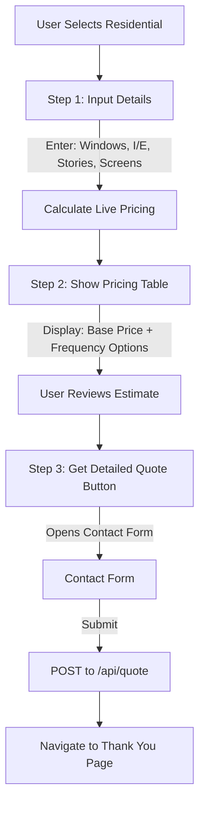

# Residential Pricing Calculator Integration

## Overview

Transform the residential estimate form from a static submission form into an interactive stepped calculator that shows live pricing estimates based on user inputs.

## Pricing Model (from image)

- **Exterior windows**: $10 per window
- **Interior windows**: $7 per window  
- **Screens**: $5 per screen
- **2nd story**: +$2 per window
- **3rd story**: +$5 per window

## Implementation Steps

### 1. Add Residential Pricing Constants

**File**: `[frontend/src/pages/FreeEstimate.tsx](frontend/src/pages/FreeEstimate.tsx)` (lines 12-21)

Add residential pricing structure after the existing commercial `PRICING` constant:

```typescript
const RESIDENTIAL_PRICING = {
  exteriorWindow: 10,
  interiorWindow: 7,
  screen: 5,
  secondStoryUpcharge: 2,  // per window
  thirdStoryUpcharge: 5,   // per window
};
```

### 2. Create Residential Calculation Function

**File**: `[frontend/src/pages/FreeEstimate.tsx](frontend/src/pages/FreeEstimate.tsx)` (after line 86)

Create a calculation function similar to `calculateQuotes()` for commercial:

```typescript
interface ResidentialInputs {
  windowCount: number;
  interiorExterior: 'Exterior Only' | 'Interior + Exterior';
  stories: '1' | '2' | '3' | '4+';
  screenCount: number;
  serviceFrequency: string;
}

function calculateResidentialQuote(inputs: ResidentialInputs) {
  const { windowCount, interiorExterior, stories, screenCount } = inputs;
  
  // Base window cost
  let windowCost = 0;
  if (interiorExterior === 'Exterior Only') {
    windowCost = windowCount * RESIDENTIAL_PRICING.exteriorWindow;
  } else {
    // Interior + Exterior
    windowCost = windowCount * (RESIDENTIAL_PRICING.interiorWindow + RESIDENTIAL_PRICING.exteriorWindow);
  }
  
  // Story upcharge
  if (stories === '2') {
    windowCost += windowCount * RESIDENTIAL_PRICING.secondStoryUpcharge;
  } else if (stories === '3' || stories === '4+') {
    windowCost += windowCount * RESIDENTIAL_PRICING.thirdStoryUpcharge;
  }
  
  // Screen cost
  const screenCost = screenCount * RESIDENTIAL_PRICING.screen;
  
  return {
    baseTotal: windowCost + screenCost,
    windowCost,
    screenCost,
    breakdown: {
      windows: windowCount,
      windowRate: interiorExterior,
      stories,
      screens: screenCount,
    }
  };
}
```

### 3. Convert ResidentialForm to Stepped Calculator

**File**: `[frontend/src/pages/FreeEstimate.tsx](frontend/src/pages/FreeEstimate.tsx)` (lines 448-691)

**Current structure**: Single long form that submits directly

**New structure**: 

- **Step 1**: Input form (windows, interior/exterior, stories, screens)
- **Step 2**: Pricing table showing estimate + service frequency options
- **Step 3**: Contact/details form (name, address, preferences, additional services)

### 4. Step 1 - Basic Input Form

Replace the current monolithic form with a stepped approach:

```typescript
const [step, setStep] = useState(1);
const [residentialInputs, setResidentialInputs] = useState<ResidentialInputs>({
  windowCount: 0,
  interiorExterior: 'Exterior Only',
  stories: '1',
  screenCount: 0,
  serviceFrequency: 'One-Time',
});
```

Step 1 UI collects:

- Number of windows
- Interior/Exterior selection
- Number of stories
- Number of screens

### 5. Step 2 - Pricing Display

Similar to commercial calculator (lines 220-390), show:

- Calculated base price
- Breakdown (windows, stories, screens)
- Service frequency options (One-time, Monthly, Quarterly, etc.)
- "Get Detailed Quote" button to proceed

### 6. Step 3 - Contact Form

Collect remaining details:

- Contact information (name, email, phone)
- Property information (address, city, ZIP, property type)
- Additional services (checkboxes)
- Contact preferences

### 7. Update API Submission

**File**: `[frontend/src/pages/FreeEstimate.tsx](frontend/src/pages/FreeEstimate.tsx)` (lines 491-536)

Modify the `handleSubmit` function to include calculated pricing in the submission:

```typescript
formInput: {
  propertyType: 'Residential',
  serviceType: residentialInputs.serviceFrequency,
  windowCount: residentialInputs.windowCount,
  screenCount: residentialInputs.screenCount,
  interiorExterior: residentialInputs.interiorExterior,
  stories: residentialInputs.stories,
  estimatedPrice: calculatedQuote.baseTotal, // Add calculated price
  additionalServices: formData.additionalServices,
  specialRequests: specialRequests || undefined,
},
```

## UI/UX Flow Diagram




## Key Files to Modify

1. `**[frontend/src/pages/FreeEstimate.tsx](frontend/src/pages/FreeEstimate.tsx)**`
  - Add `RESIDENTIAL_PRICING` constants (after line 21)
  - Add `calculateResidentialQuote()` function (after line 86)
  - Refactor `ResidentialForm` component to stepped calculator (lines 448-691)
  - Update state management for steps
  - Add pricing display UI
2. `**[api/src/quote.ts](api/src/quote.ts)**` (optional backend update)
  - May need to add fields for `interiorExterior`, `stories`, `estimatedPrice`
  - Validation for new residential-specific fields

## Testing Checklist

- Pricing calculates correctly for exterior-only windows
- Pricing calculates correctly for interior + exterior
- Story upcharges apply correctly (2nd = +$2, 3rd = +$5)
- Screen costs calculated correctly
- Step navigation works smoothly
- Form submission includes all data
- Backend receives and stores estimate

## Notes

- Keep the current commercial calculator unchanged
- Maintain the same visual design language (Japanese minimalist aesthetic)
- Ensure mobile responsiveness for all steps
- Pricing is an estimate - disclaimer text remains important

